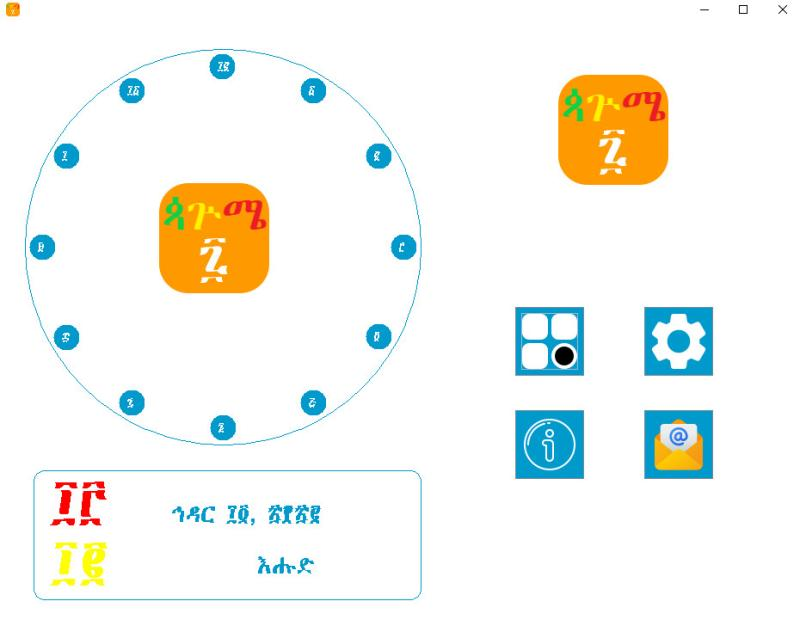
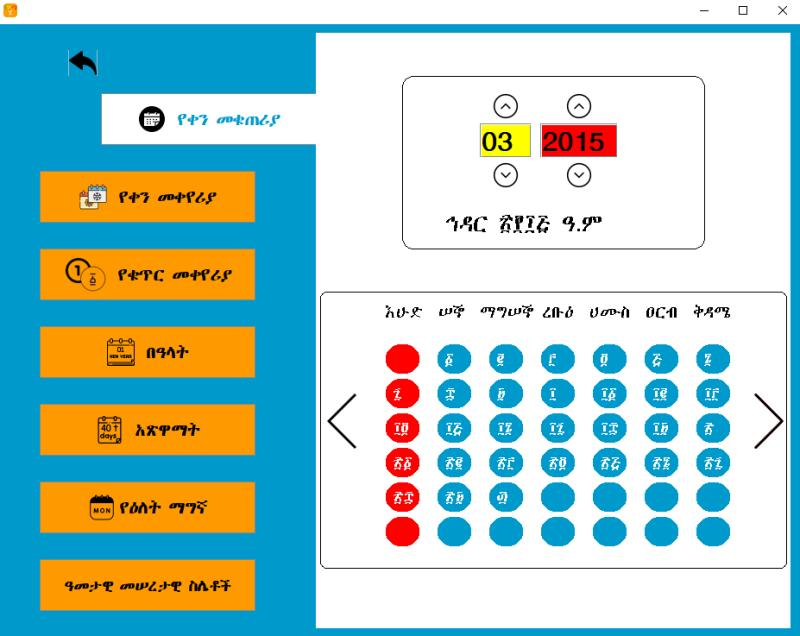
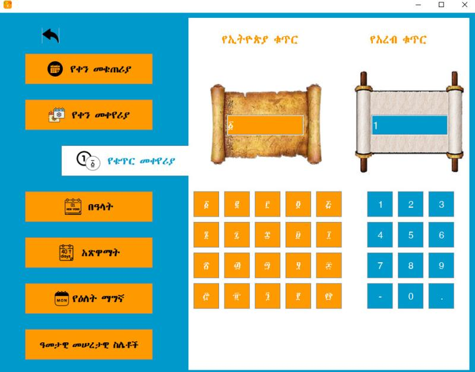
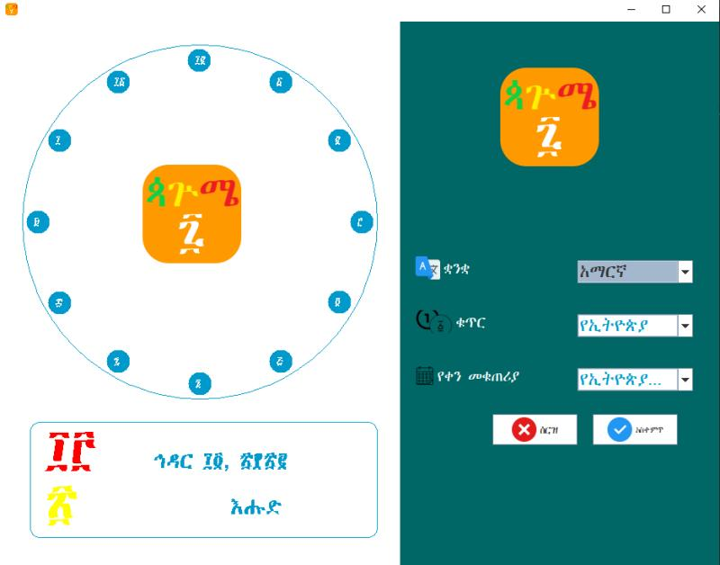

# Pagume 7

**Pagume 7** is a Java Swing-based calendar tool that provides features for both Ethiopian and Gregorian calendars. This application is designed to handle date conversions, number translations, and various date-related calculations.

## Features

- **Monthly Calendar Display**: View monthly calendars for both Ethiopian and Gregorian calendars.
- **Date Conversion**: Convert dates from Ethiopian to Gregorian and vice versa with ease.
- **Number Conversion**: Translate numbers between Amharic and Arabic numeral systems.
- **Holiday & Fasting Calculation**: Calculate the dates for holidays and fasting periods of a given year.
- **Weekday Finder**: Determine the weekday for any given date.

## Technologies Used

- **Programming Language**: *Java*
- **Framework**: *Java Swing* for the graphical user interface
<table>
  <tr>
  </tr>
  <tr>
    <td></td>
  </tr>

  <tr>
    <td></td>
  </tr>

  <tr>
    <td></td>
  </tr>
  
  <tr>
    <td></td>
  </tr>
</table>
